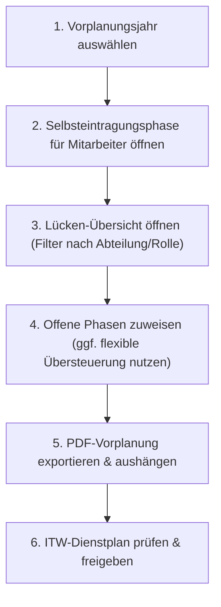

# 📘 Leitfaden & Anleitung für ITW-Planer

Dieses Dokument bietet eine vollständige Übersicht über alle Funktionen, Werkzeuge und Berechtigungen, die **ITW-Planern** (Benutzer mit erweiterten Schreibrechten bzw. Administratoren) in **RD-Plan** zur Verfügung stehen.

---

## 📑 Inhaltsverzeichnis
1. [Übersicht & Rollenrechte](#1-übersicht--rollenrechte)
2. [Die ITW-Vorplanung](#2-die-itw-vorplanung)
3. [Phasenbesetzung & Qualifikationslogik](#3-phasenbesetzung--qualifikationslogik)
4. [Lücken-Übersicht & Schnelleinteilung](#4-lücken-übersicht--schnelleinteilung)
5. [PDF-Export im 1-Seiten-Kachel-Layout](#5-pdf-export-im-1-seiten-kachel-layout)
6. [Automatischer Abgleich mit dem ITW-Dienstplan](#6-automatischer-abgleich-mit-dem-itw-dienstplan)
7. [Empfohlener Planungsablauf (Best Practice)](#7-empfohlener-planungsablauf-best-practice)

---

## 1. Übersicht & Rollenrechte

In RD-Plan wird die ITW-Planung über differenzierte Berechtigungen gesteuert:

| Rolle / Recht | Vorplanung (`itw_vorplanung`) | ITW-Dienstplan (`itw_dienstplan`) | Beschreibung |
| :--- | :--- | :--- | :--- |
| **Administrator / ITW-Planer (Alle)** | `Schreibrechte Alle` (`write_all`) | `Alle Lesen` (`read_all`) | Voller Zugriff auf alle Abteilungen, Phasen, Zuweisungen und Exporte. |
| **Abteilungs-Planer** | `Schreibrechte` (`write`) | `Lesen` (`read`) | Kann nur freigegebene Positionen der eigenen Abteilung besetzen. |
| **Mitarbeiter (Selbsteintragung)** | `Schreibrechte` (`write`) | `Lesen` (`read`) | Trägt sich selbst in freie Positionen der eigenen Abteilung ein. |
| **Reine Einsicht** | `Leserechte` (`read`) | `Lesen` (`read`) | Nur Ansicht des eigenen Namens bzw. der Vorplanung ohne Bearbeitung. |

---

## 2. Die ITW-Vorplanung

### Navigation & Jahresauswahl
1. Öffne im linken Hauptmenü den Punkt **ITW**.
2. Wähle oben den Reiter **ITW Vorplanung**.
3. Über die Pfeile `<` und `>` im Kopfbereich kannst du das gewünschte **Planungsjahr** (z. B. *2027*) auswählen.

### Phasenstruktur
* Das Vorplanungsjahr ist in **3-wöchige Rotationsphasen (21 Tage)** unterteilt.
* Jede Phasenkarte enthält 3 Planstellen:
  * **Fahrzeugführer 1** *(farblich nach zuständiger Abteilung gekennzeichnet)*
  * **Fahrzeugführer 2** *(farblich nach zuständiger Abteilung gekennzeichnet)*
  * **Maschinist** *(farblich nach zuständiger Abteilung gekennzeichnet)*
* **Farbcodierung der Abteilungen:**
  * 🔴 **1. Abteilung**: Roter Akzent
  * 🔵 **2. Abteilung**: Blauer Akzent
  * 🟢 **3. Abteilung**: Grüner Akzent

---

## 3. Phasenbesetzung & Qualifikationslogik

### Intelligente Dropdown-Filterung
* Im Auswahl-Dropdown werden **nur Kollegen aufgeführt, die mindestens eine ITW-Qualifikation besitzen**:
  * *ITW Fahrzeugführer* (bzw. *Fahrzeugführer* / *Fahrzeugführer HLF-B*)
  * *ITW Maschinist*
* Personal ohne jegliche ITW-Qualifikation wird **automatisch ausgeblendet**, um die Auswahlliste übersichtlich und kompakt zu halten.

### Flexible Einteilung & Qualifikations-Übersteuerung (für Planer mit `Schreibrechte Alle`)
* Als ITW-Planer mit `write_all` kannst du Positionen **abteilungsübergreifend** und bei Bedarf **unabhängig von der spezifischen Teilqualifikation** besetzen:
  * Fehlt einem Kollegen für eine gewählte Position die spezifische Qualifikation (z. B. Maschinist wird für eine Fahrzeugführer-Position ausgewählt), wird die Option im Dropdown **orange hervorgehoben** mit dem Zusatz `(FzF fehlt)` bzw. `(Ma fehlt)`.
  * Beim Auswählen öffnet sich ein **Bestätigungshinweis**:
    > *„Hinweis: [Mitarbeiter] besitzt keine Fahrzeugführer-Qualifikation! Trotzdem für die Rolle [Rolle] einteilen?“*
  * Durch Bestätigen mit **OK** wird die Zuweisung trotzdem vollzogen.

### Austragen / Korrektur
* Wähle im Dropdown einfach **`- Nicht besetzt -`** aus. Die Schichten werden automatisch aus dem Dienstplan des Kollegen entfernt.

---

## 4. Lücken-Übersicht & Schnelleinteilung

Um unbesetzte Dienste schnell zu identifizieren, gibt es im Kopfbereich den Button **„Lücken anzeigen“** mit Live-Zähler (z. B. `3 offene Stellen`).

### Funktionen des Lücken-Modals:
1. **Filterung:**
   * Nach **Abteilung** (Alle, 1., 2. oder 3. Abteilung)
   * Nach **Rolle** (Alle, Fahrzeugführer 1, Fahrzeugführer 2, Maschinist)
2. **Direkt-Zuweisung:**
   * Jede offene Lücke bietet ein Dropdown **„- Jetzt zuordnen -“**, über das direkt ein geeigneter Kollege eingeteilt werden kann (ohne erst zur Karte scrollen zu müssen).
3. **Klick-Navigation:**
   * Ein Klick auf **„Zur Phase springen“** schließt das Modal und scrollt die Seite direkt zur entsprechenden Phasenkachel mit sanfter Animation.

---

## 5. PDF-Export im 1-Seiten-Kachel-Layout

Für Aushänge, Besprechungen oder Archivierung steht die Funktion **„PDF Export“** bereit:

* **1-Seiten-Optimierung:** Das Layout ist so berechnet, dass alle Phasen des gesamten Jahres in einem ansprechenden Kachel-Grid auf **genau einer DIN-A4-Seite (Querformat)** Platz finden.
* **Inhalte des PDF-Exports:**
  * Vollständiger Kopfbereich mit Jahr, Planungsstand und Abteilungslegende.
  * Phasenblöcke mit Datumsbereichen und Ferien-/Feiertagskennzeichnung.
  * Farbcodierte Rollenkacheln mit Namen der eingeteilten Kollegen bzw. Kennzeichnung freier Stellen.
* **Druck/Export:** Öffnet den Standard-Druckdialog des Betriebssystems („Als PDF speichern“ oder Direktdruck).

---

## 6. Automatischer Abgleich mit dem ITW-Dienstplan

Jede Einteilung in der Vorplanung wirkt sich in Echtzeit auf das Gesamtsystem aus:

1. **Automatische Dienstgenerierung (`IW`):**
   * Bei Zuweisung werden automatisch alle ITW-Dienste der zugeordneten Abteilung innerhalb des 21-Tage-Fensters im **ITW-Dienstplan** eingetragen.
   * Gesetzliche Feiertage werden dabei automatisch berücksichtigt und freigehalten.
2. **Bereinigung:**
   * Beim Umtragen oder Entfernen werden die alten Dienste automatisch gelöscht.
3. **Datensicherheit & Historie:**
   * Alle Zuweisungen werden in der zentralen Datenbank gespeichert und synchronisiert.

---

## 7. Empfohlener Planungsablauf (Best Practice)

1. **Vorbereitung:** Jahr prüfen und sicherstellen, dass die Stammdaten und ITW-Qualifikationen in der Personalverwaltung aktuell gepflegt sind.
2. **Mitarbeiter-Eintragungsphase:** Mitarbeiter mit Lese-/Schreibrechten tragen sich selbst für ihre Abteilungsphasen ein.
3. **Lückenprüfung:** Planer öffnen die **Lücken-Übersicht** und prüfen unbesetzte Slots.
4. **Feinabstimmung:** Zuweisung der verbleibenden Lücken über die Schnelleinteilung oder direkt in den Phasenkarten.
5. **Export & Verteilung:** Erstellung des **1-Seiten-PDF-Aushangs** über den PDF-Export-Button.
